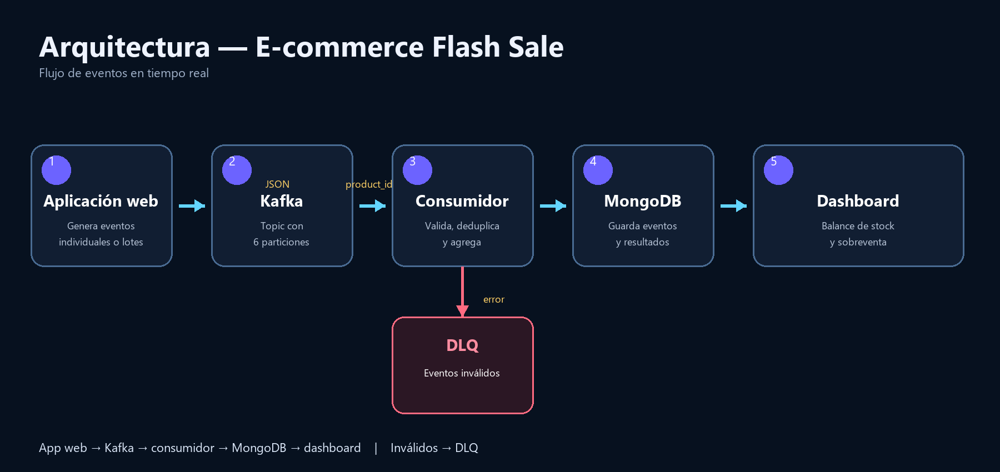
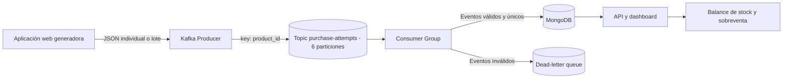

# Diagrama de arquitectura

## Explicación

La aplicación web genera intentos de compra individuales o masivos en formato JSON. El productor envía cada evento a Kafka usando `product_id` como clave, por lo que los eventos del mismo producto mantienen su orden dentro de una partición. El grupo de consumidores valida el esquema, descarta duplicados y calcula agregaciones. Los eventos inválidos pasan a la DLQ. MongoDB conserva los eventos y resultados; la API los presenta en el dashboard para calcular el balance de stock y detectar sobreventa.

