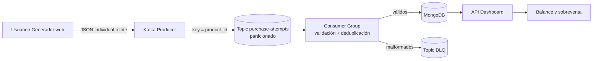

# Plataforma E-commerce Flash Sale en tiempo real

Proyecto integrador de Big Data: genera intentos de compra realistas, los ingiere con Kafka, limpia y agrega eventos con un consumidor, persiste resultados en MongoDB y muestra el balance de stock en un dashboard.

## Video de defensa

La demostración completa del proyecto está disponible en YouTube:

[Ver defensa oral y demostración funcional](https://youtu.be/rMYr03-d_yk?si=1SsloGZWndLBaxyI)

## Arquitectura



## Ejecución

Requisitos: Docker Desktop con Docker Compose y puertos 8010, 9092 y 27017 libres.

```bash
docker compose up --build
```

Espere a que los servicios estén saludables y abra `http://localhost:8010`. Para detener:

```bash
docker compose down
```

Para borrar únicamente los datos de esta práctica y comenzar de cero:

```bash
docker compose down -v
```

## Demostración

1. Hice un intento individual para comprobar que el evento llegaba correctamente.
2. Después realicé pruebas con lotes de 6,000 intentos o más para simular una venta flash.
3. Observé cómo el dashboard se actualizaba y aumentaban las unidades solicitadas.
4. Repetí la prueba hasta que un producto quedó en estado `SOBREVENTA`.
5. También revisé el funcionamiento del consumidor con `docker compose logs -f worker`.

## Modelo del evento

```json
{
  "event_id": "UUID",
  "product_id": "P001",
  "customer_id": "C02491",
  "quantity": 2,
  "unit_price": 899.99,
  "category": "Electrónica",
  "event_time": "2026-08-02T18:00:00+00:00",
  "source": "flash-sale-web"
}
```

`event_id` permite deduplicar; `product_id` es la clave de partición para preservar el orden por producto; `event_time` permite ventanas temporales; precio y cantidad permiten calcular exposición monetaria. La distribución es sesgada: los productos virales aparecen más y la cantidad 1 es más probable. Se inyectan 1% de malformados y 1% de duplicados en lotes para probar calidad de datos.

## Pruebas

```bash
docker compose run --rm web python -m pytest
```

En una ejecución real, anote aquí sus resultados antes de entregar: volumen probado, segundos, eventos/s, registros válidos, duplicados descartados, inválidos enviados a DLQ y lag máximo. No invente cifras: muestre el resultado que devuelve la interfaz.
